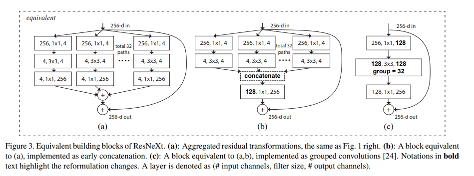
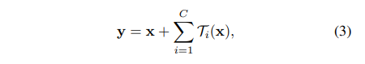
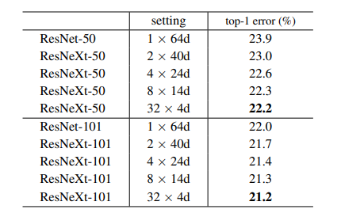

# ResNext
## ポイント
- Residualブロックに、Inceptionと同様のsplit-transform-merge（分割,変換,マージ)戦略を適用し、横にネットワークを拡張した
- Inceptionと大きく違うのは、横に拡張されたネットワークのトポロジー（convのパラメータ）は全て同じ値をもつ。これによって、パラメータ調整の手間が省ける
- **ネットワークを深く、広くするよりも、カーディナリティを増やす方が精度を上げるために効果的**
## NEW Residual Block
</img>
- 残差ブロックの幅をInceptionのように拡張した
- チャンネルを分割し、1×1convで畳み込み、その出力マップに3×3convで畳み込む。最後に出力を結合したものに1×1convで畳み込みを行う
- チャンネルを分割するサイズは**Cardinarity**とよばれるパラメータによって制御される
- Inceptionではブロック中様々なサイズの畳み込みフィルタを用意していたが、ResNeXtでは3×3に固定。これによってネットワークのパラメータを調整する領域が格段に減少する
- 上記の考えはInceptionの Network in Newtowork とは対照的に, **Network in Nueron**と呼ばれる
</img>
- チャンネルの増がある部分は1×1畳み込みでチャンネル数を上げる
## トレーニング方法
- インプットサイズは224×224 
- データオーギュメンテーション：randomly cropped, aspect ratio augmentation
- SGD：lr 0.1, weight decay 0.0001, momentum 0.9
- 3エポック毎に10で割り算
- ミニバッチサイズ：256
- 初期の重みは右記で初期化（K. He, X. Zhang, S. Ren, and J. Sun. Delving deep into rectifiers: Surpassing human-level performance on imagenet classification. In ICCV, 2015.）  
## テスト推論
- 224×224 center crop 画像で評価
</img>
- 結果によると同一パラメータのResnetより、精度が向上している
## 参考
1. https://arxiv.org/pdf/1611.05431.pdf
2. https://pystyle.info/pytorch-resnext/

